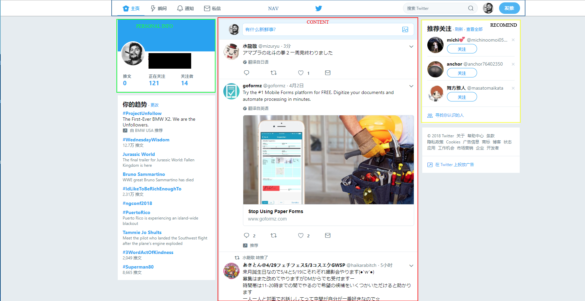

# CS554_FinalProject
A SNS web app based on react.

our twitter like app will contain folloing parts:
 - database  (saving user info)
 - web server (interact with user)
 - api manipulator

twitter's UI is very simple,

what we need to do:
 - login system
 - use steam api
 - twitter system(release,refresh,recommand by game and so on).

we need to learn how to use steam api it's a big project.

About what kind of content we need: 
 - account login
 - account info(base info and game info)

What do we need for database
 -store account info
 -store image upload
 -store game info for recomend
